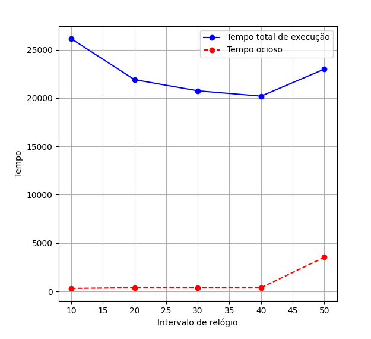

# Introdução

Este relatório apresenta os resultados do desenvolvimento de um simulador de um sistema operacional (SO), com base nos requisitos especificados no README. Inicialmente, o simulador era capaz de executar apenas um programa por vez, limitado a um contexto de execução estático. A evolução do projeto incluiu a criação de um SO que suporta múltiplos processos e implementa funcionalidades fundamentais como escalonadores, bloqueio e desbloqueio de processos, e preempção.

Todas as funcionalidades especificadas no README foram implementadas. O SO desenvolvido agora é capaz de gerenciar eficientemente o ciclo de vida dos processos, utilizando três escalonadores (simples, Round-Robin e baseado em prioridade) para distribuição de CPU, além de coletar métricas  sobre o desempenho e comportamento do sistema.

As seções a seguir detalham o funcionamento das implementações, os experimentos realizados com diferentes configurações do sistema e a análise dos resultados obtidos.

## Escalonadores utilizados

Conforme supracitado, adotou-se três abordagens de escalonadores, as quais são detalhadas a seguir:

- **Simples:** o escalonador simples foi implementado como uma abordagem básica para a distribuição de CPU entre os processos. Ele simplesmente seleciona o primeiro processo no estado pronto dos processos. A implementação deste escalonador é direta. Espera-se que este escalonador seja eficiente em cenários com baixa carga de processos, mas pode apresentar problemas na justiça e tempo de resposta em alguns sistemas.

- **Round-Robin:** o escalonador Round-Robin busca melhorar a justiça na distribuição de CPU, especialmente em sistemas com múltiplos processos concorrentes. Ele utiliza um quantum de tempo fixo, onde cada processo recebe uma fatia de tempo para execução antes de ser preemptado e colocado no final da fila. Implementou-se utilizando uma fila circular e a contagem do tempo de execução de cada processo. Espera-se tempos de resposta mais previsíveis e justos, evitando que processos de longa duração monopolizem a CPU.

- **Baseado em prioridade:** busca-se atender a diferentes níveis de importância entre os processos. Cada processo é atribuído a uma prioridade, e o escalonador seleciona o processo com a maior prioridade para execução. Espera-se eficiência na maioria dos casos e uso e testes.
  
## Resultados

Durante a execução do sistema, foram monitoradas algumas métricas para avaliar o desempenho e o comportamento do sistema operacional. Entre essas métricas, incluem-se: o número total de processos criados, o tempo total de execução, o tempo total em que o sistema permaneceu ocioso (com todos os processos bloqueados), o número de interrupções recebidas de cada tipo e o número de preempções realizadas. Além disso, foram calculados o tempo de retorno de cada processo (diferença entre o momento de criação e término), o número de preempções por processo, a frequência com que cada processo entrou em diferentes estados (pronto, bloqueado, executando), o tempo total de cada processo em cada estado e o tempo médio de resposta em estado pronto.

A seguir, detalhar-se-ão os resultados obtidos com a execução do sistema operacional utilizando os três escalonadores desenvolvidos, considerando-se diferentes valores de quantum e intervalos de instruções para interrupção de relógio.

### Simples

MÉTRICAS DO SO (quantum: 5, intervalo: 50):
 
| MÉTRICA                   | VALOR      |
|---------------------------|------------|
| NÚMERO DE PROCESSOS       | 4          |
| TEMPO TOTAL DE EXECUÇÃO   | 27941      |
| TEMPO TOTAL OCIOSO        | 8562       |
| NÚMERO DE PREEMPÇÕES      | 0          |

INTERRUPÇÕES:
| IRQ   | VEZES      |
|-------|------------|
| 0     | 1          |
| 1     | 0          |
| 2     | 462        |
| 3     | 557        |
| 4     | 0          |
| 5     | 0          |

MÉTRICAS DOS PROCESSOS:
 
PROCESSO 1
 
| MÉTRICA                | VALOR      |
|------------------------|------------|
| PREEMPÇÕES             | 0          |
| TEMPO DE RESPOSTA      | 0          |
| TEMPO DE RETORNO       | 27941      |

MÉTRICAS POR ESTADO DO PROCESSO 1:

 
| ESTADO     | VEZES      | TEMPO TOTAL  |
|------------|------------|--------------|
| EXECUTANDO | 3          | 743          |
| PRONTO     | 4          | 0            |
| BLOQUEADO  | 3          | 27198        |
| MORTO      | 1          | 0            |

PROCESSO 2
 
| MÉTRICA                | VALOR      |
|------------------------|------------|
| PREEMPÇÕES             | 0          |
| TEMPO DE RESPOSTA      | 490        |
| TEMPO DE RETORNO       | 13008      |

MÉTRICAS POR ESTADO DO PROCESSO 2:

 
| ESTADO     | VEZES      | TEMPO TOTAL  |
|------------|------------|--------------|
| EXECUTANDO | 7          | 9153         |
| PRONTO     | 7          | 3431         |
| BLOQUEADO  | 6          | 424          |
| MORTO      | 1          | 14550        |

PROCESSO 3
 
| MÉTRICA                | VALOR      |
|------------------------|------------|
| PREEMPÇÕES             | 0          |
| TEMPO DE RESPOSTA      | 482        |
| TEMPO DE RETORNO       | 15831      |

MÉTRICAS POR ESTADO DO PROCESSO 3:

 
| ESTADO     | VEZES      | TEMPO TOTAL  |
|------------|------------|--------------|
| EXECUTANDO | 22         | 3762         |
| PRONTO     | 22         | 10607        |
| BLOQUEADO  | 21         | 1462         |
| MORTO      | 1          | 11719        |

PROCESSO 4
 
| MÉTRICA                | VALOR      |
|------------------------|------------|
| PREEMPÇÕES             | 0          |
| TEMPO DE RESPOSTA      | 95         |
| TEMPO DE RETORNO       | 27223      |

MÉTRICAS POR ESTADO DO PROCESSO 4:

 
| ESTADO     | VEZES      | TEMPO TOTAL  |
|------------|------------|--------------|
| EXECUTANDO | 131        | 5721         |
| PRONTO     | 131        | 12532        |
| BLOQUEADO  | 130        | 8970         |
| MORTO      | 1          | 319          |

O escalonador simples executa os processos de forma sequencial e sem preempção, o que leva a um tempo total de execução de 27.941 e um tempo ocioso de 8.562. A falta de preempção impede a interrupção de um processo em execução, o que pode gerar tempos de resposta elevados, como observado nos processos. Isso é mais evidente quando há um processo com tempo de execução muito curto, que poderia ser completado rapidamente se tivesse sua execução interrompida por processos mais longos. A métrica de tempo ocioso foi significativamente elevada em comparação com o tempo de execução efetivo, refletindo a falta de eficiência na utilização da CPU. O intervalo de 50 unidades de tempo para interrupções (IRQ) não foi suficiente para manter a CPU continuamente ocupada, principalmente porque os processos ficaram bloqueados por longos períodos. A principal limitação desse modelo está na ineficiência para lidar com múltiplos processos de diferentes durações, o que compromete a utilização eficiente da CPU.

### Round-Robim

MÉTRICAS DO SO (quantum: 5, intervalo: 50):
 
| MÉTRICA                   | VALOR      |
|---------------------------|------------|
| NÚMERO DE PROCESSOS       | 4          |
| TEMPO TOTAL DE EXECUÇÃO   | 24049      |
| TEMPO TOTAL OCIOSO        | 4610       |
| NÚMERO DE PREEMPÇÕES      | 56         |

INTERRUPÇÕES:
| IRQ   | VEZES      |
|-------|------------|
| 0     | 1          |
| 1     | 0          |
| 2     | 462        |
| 3     | 479        |
| 4     | 0          |
| 5     | 0          |

MÉTRICAS DOS PROCESSOS:
 
PROCESSO 1
 
| MÉTRICA                | VALOR      |
|------------------------|------------|
| PREEMPÇÕES             | 0          |
| TEMPO DE RESPOSTA      | 0          |
| TEMPO DE RETORNO       | 24049      |

MÉTRICAS POR ESTADO DO PROCESSO 1:

 
| ESTADO     | VEZES      | TEMPO TOTAL  |
|------------|------------|--------------|
| EXECUTANDO | 2          | 743          |
| PRONTO     | 3          | 0            |
| BLOQUEADO  | 2          | 23306        |
| MORTO      | 1          | 0            |

PROCESSO 2
 
| MÉTRICA                | VALOR      |
|------------------------|------------|
| PREEMPÇÕES             | 39         |
| TEMPO DE RESPOSTA      | 152        |
| TEMPO DE RETORNO       | 17097      |

MÉTRICAS POR ESTADO DO PROCESSO 2:

 
| ESTADO     | VEZES      | TEMPO TOTAL  |
|------------|------------|--------------|
| EXECUTANDO | 48         | 9198         |
| PRONTO     | 48         | 7307         |
| BLOQUEADO  | 8          | 592          |
| MORTO      | 1          | 6569         |

PROCESSO 3
 
| MÉTRICA                | VALOR      |
|------------------------|------------|
| PREEMPÇÕES             | 12         |
| TEMPO DE RESPOSTA      | 284        |
| TEMPO DE RETORNO       | 11989      |

MÉTRICAS POR ESTADO DO PROCESSO 3:

 
| ESTADO     | VEZES      | TEMPO TOTAL  |
|------------|------------|--------------|
| EXECUTANDO | 26         | 3756         |
| PRONTO     | 26         | 7403         |
| BLOQUEADO  | 13         | 830          |
| MORTO      | 1          | 11669        |

PROCESSO 4
 
| MÉTRICA                | VALOR      |
|------------------------|------------|
| PREEMPÇÕES             | 5          |
| TEMPO DE RESPOSTA      | 96         |
| TEMPO DE RETORNO       | 23331      |

MÉTRICAS POR ESTADO DO PROCESSO 4:

 
| ESTADO     | VEZES      | TEMPO TOTAL  |
|------------|------------|--------------|
| EXECUTANDO | 110        | 5742         |
| PRONTO     | 110        | 10610        |
| BLOQUEADO  | 104        | 6979         |
| MORTO      | 1          | 319          |

No escalonador Round-Robin, cada processo recebe uma fatia de tempo igual (quantum de 5 unidades), o que permite maior equilíbrio na distribuição de tempo de CPU. Com um total de 56 preempções, o sistema obteve um tempo total de execução de 24.049  e um tempo ocioso de 4.610. O tempo de resposta e de execução foi reduzido para os processos em comparação com o escalonador simples, uma redução de 14% no tempo de execução. No entanto, as preempções frequentes podem gerar overhead em sistemas com processos mais longos, onde o tempo gasto com trocas de contexto pode reduzir a eficiência no contexto geral.

### Prioritário

MÉTRICAS DO SO (quantum: 5, intervalo: 50):
 
| MÉTRICA                   | VALOR      |
|---------------------------|------------|
| NÚMERO DE PROCESSOS       | 4          |
| TEMPO TOTAL DE EXECUÇÃO   | 22997      |
| TEMPO TOTAL OCIOSO        | 3540       |
| NÚMERO DE PREEMPÇÕES      | 57         |

INTERRUPÇÕES:
| IRQ   | VEZES      |
|-------|------------|
| 0     | 1          |
| 1     | 0          |
| 2     | 462        |
| 3     | 458        |
| 4     | 0          |
| 5     | 0          |

MÉTRICAS DOS PROCESSOS:
 
PROCESSO 1
 
| MÉTRICA                | VALOR      |
|------------------------|------------|
| PREEMPÇÕES             | 0          |
| TEMPO DE RESPOSTA      | 0          |
| TEMPO DE RETORNO       | 22997      |

MÉTRICAS POR ESTADO DO PROCESSO 1:

 
| ESTADO     | VEZES      | TEMPO TOTAL  |
|------------|------------|--------------|
| EXECUTANDO | 2          | 743          |
| PRONTO     | 3          | 0            |
| BLOQUEADO  | 2          | 22254        |
| MORTO      | 1          | 0            |

PROCESSO 2
 
| MÉTRICA                | VALOR      |
|------------------------|------------|
| PREEMPÇÕES             | 39         |
| TEMPO DE RESPOSTA      | 165        |
| TEMPO DE RETORNO       | 17751      |

MÉTRICAS POR ESTADO DO PROCESSO 2:

 
| ESTADO     | VEZES      | TEMPO TOTAL  |
|------------|------------|--------------|
| EXECUTANDO | 48         | 9207         |
| PRONTO     | 48         | 7950         |
| BLOQUEADO  | 8          | 594          |
| MORTO      | 1          | 4863         |

PROCESSO 3
 
| MÉTRICA                | VALOR      |
|------------------------|------------|
| PREEMPÇÕES             | 13         |
| TEMPO DE RESPOSTA      | 240        |
| TEMPO DE RETORNO       | 11379      |

MÉTRICAS POR ESTADO DO PROCESSO 3:

 
| ESTADO     | VEZES      | TEMPO TOTAL  |
|------------|------------|--------------|
| EXECUTANDO | 27         | 3792         |
| PRONTO     | 27         | 6492         |
| BLOQUEADO  | 13         | 1095         |
| MORTO      | 1          | 11227        |

PROCESSO 4
 
| MÉTRICA                | VALOR      |
|------------------------|------------|
| PREEMPÇÕES             | 5          |
| TEMPO DE RESPOSTA      | 100        |
| TEMPO DE RETORNO       | 22279      |

MÉTRICAS POR ESTADO DO PROCESSO 4:

 
| ESTADO     | VEZES      | TEMPO TOTAL  |
|------------|------------|--------------|
| EXECUTANDO | 102        | 5715         |
| PRONTO     | 102        | 10282        |
| BLOQUEADO  | 96         | 6282         |
| MORTO      | 1          | 319          |

MÉTRICAS DO SO (quantum: 5, intervalo: 40):
 
| MÉTRICA                   | VALOR      |
|---------------------------|------------|
| NÚMERO DE PROCESSOS       | 4          |
| TEMPO TOTAL DE EXECUÇÃO   | 20196      |
| TEMPO TOTAL OCIOSO        | 391        |
| NÚMERO DE PREEMPÇÕES      | 75         |

INTERRUPÇÕES:
| IRQ   | VEZES      |
|-------|------------|
| 0     | 1          |
| 1     | 0          |
| 2     | 462        |
| 3     | 503        |
| 4     | 0          |
| 5     | 0          |

MÉTRICAS DOS PROCESSOS:
 
PROCESSO 1
 
| MÉTRICA                | VALOR      |
|------------------------|------------|
| PREEMPÇÕES             | 1          |
| TEMPO DE RESPOSTA      | 453        |
| TEMPO DE RETORNO       | 20196      |

MÉTRICAS POR ESTADO DO PROCESSO 1:

 
| ESTADO     | VEZES      | TEMPO TOTAL  |
|------------|------------|--------------|
| EXECUTANDO | 3          | 755          |
| PRONTO     | 4          | 1812         |
| BLOQUEADO  | 2          | 17629        |
| MORTO      | 1          | 0            |

PROCESSO 2
 
| MÉTRICA                | VALOR      |
|------------------------|------------|
| PREEMPÇÕES             | 52         |
| TEMPO DE RESPOSTA      | 153        |
| TEMPO DE RETORNO       | 19282      |

MÉTRICAS POR ESTADO DO PROCESSO 2:

 
| ESTADO     | VEZES      | TEMPO TOTAL  |
|------------|------------|--------------|
| EXECUTANDO | 61         | 9405         |
| PRONTO     | 61         | 9384         |
| BLOQUEADO  | 8          | 493          |
| MORTO      | 1          | 525          |

PROCESSO 3
 
| MÉTRICA                | VALOR      |
|------------------------|------------|
| PREEMPÇÕES             | 15         |
| TEMPO DE RESPOSTA      | 246        |
| TEMPO DE RETORNO       | 11969      |

MÉTRICAS POR ESTADO DO PROCESSO 3:

 
| ESTADO     | VEZES      | TEMPO TOTAL  |
|------------|------------|--------------|
| EXECUTANDO | 29         | 3867         |
| PRONTO     | 29         | 7159         |
| BLOQUEADO  | 13         | 943          |
| MORTO      | 1          | 7830         |

PROCESSO 4
 
| MÉTRICA                | VALOR      |
|------------------------|------------|
| PREEMPÇÕES             | 7          |
| TEMPO DE RESPOSTA      | 101        |
| TEMPO DE RETORNO       | 19466      |

MÉTRICAS POR ESTADO DO PROCESSO 4:

 
| ESTADO     | VEZES      | TEMPO TOTAL  |
|------------|------------|--------------|
| EXECUTANDO | 87         | 5778         |
| PRONTO     | 87         | 8830         |
| BLOQUEADO  | 79         | 4858         |
| MORTO      | 1          | 325          |

O escalonador prioritário atribui prioridades aos processos e executa aqueles com maior prioridade primeiro, utilizando um quantum de 5 unidades de tempo e intervalo de 50 unidades. O tempo total de execução foi de 22.997  e o tempo ocioso foi de 3.540, com 57 preempções. Esse escalonador demonstrou uma significativa melhoria no tempo de retorno, tempo de execução dos processos e no tempo ocioso, uma melhoria de 17.8% no tempo de execução em relação ao escalonador Simples, alem de uma diminuição de cerca de 60% no tempo ocioso. Como foi o escalonador mais eficiente, testou-se para diversos tamanhos de intervalo (como pode ser obserado na figura da poróxima seção). Assim, percebeu-se que, a redução do intervalo para 40 unidades de tempo aumentou a frequência de interrupções e teve um impacto direto no aumento de preempções e na diminuição do tempo de execução, percebe-se essa redução somente até as 20 unidades de tempo, após isso o tempo de execução aumentou, o tempo de ociosidade no entando, continuou a diminuir.

## Gráfico tempo total x intervalo de relógio

## Comparação do tempo total dos escalonadores para quantu=5 e intervalo=50

| MÉTRICA                      | SIMPLES  | ROUND-ROBIN | PRIORITÁRIO |
|------------------------------|----------|-------------|-------------|
| **NÚMERO DE PROCESSOS**       | 4        | 4           | 4           |
| **TEMPO TOTAL DE EXECUÇÃO**   | 27.941   | 24.049      | 22.997      |
| **TEMPO TOTAL OCIOSO**        | 8.562    | 4.610       | 3.540       |
| **NÚMERO DE PREEMPÇÕES**      | 0        | 56          | 57          |

## Conclusão

A análise dos três escalonadores evidencia diferentes *trade-offs* entre justiça, eficiência e tempos de resposta. O escalonador simples foi o mais ineficiente em termos de utilização de CPU, apresentando uma alta taxa de ociosidade. O Round-Robin garantiu uma distribuição mais justa dos recursos da CPU, com redução significativa no tempo de resposta e menos ociosidade em relação ao escalonador simples. No entanto, o escalonador prioritário, foi o mais eficaz na execução de processos, reduzindo a ociosidade e melhorando a utilização da CPU, especialmente quando o intervalo de interrupção foi ajustado. Por conseguinte, pode-se dizer que, a escolha do escalonador ideal depende dos requisitos específicos do sistema e das prioridades de desempenho que se deseja atingir, levando em conta as necessidades de justiça, eficiência e tempo de resposta.
